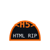
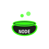
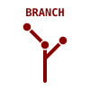
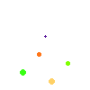

<h1 align="center">🔮 GRIMOIRE ACCESS NODE // CHARANBS18 🔮</h1>

  

<!-- Spooky Decorative Panel -->

  

<!-- Bio Section -->

  

<table align="center" border="0" cellpadding="15" cellspacing="0" style="border: 0px; border-collapse: collapse; margin: 0px auto; background-color: #0d1117;">
  <tr style="border: 0px;">
    <!-- Profile Frame -->
    <td align="center" valign="middle" style="border: 0px; padding: 10px; width: 40%;">
      

        
        <!-- Floating typing ghost animation -->
        
      

    </td>
    <!-- Bio Monospace Details -->
    <td valign="top" style="border: 0px; padding: 20px; width: 60%; font-family: monospace; color: #f8f9fa;">
      <h3 style="color: #ff7518; margin-top: 0;">&gt; COFFIN_NODE.conf</h3>
      
<b>&gt; IDENTITY:</b> Charan BS / @CharanBS18

      
<b>&gt; ACCESS_PORT:</b> <a href="mailto:charan201204@gmail.com" style="color: #39ff14;">charan201204@gmail.com</a>

      
<b>&gt; ALIGNMENT:</b> <code style="color: #ffd166;">Chaotic Creative Developer</code>

      

      

        Welcome, mortal visitor, to the spectral repository node. I craft responsive, high-performance web structures using midnight potions, green slime, and dark-mode coding rituals. I believe in clean code, robust architectures, and pixel-perfect design craftsmanship.
      

    </td>
  </tr>
</table>

  

<!-- Tech Stack Section -->

  

  
  
  
  
  
  
  
  
  

<!-- Cauldron and witch hat animation -->

  
  
  

  

<!-- Stats Section -->

  

<table align="center" border="0" cellpadding="10" cellspacing="0" style="border: 0px; border-collapse: collapse; margin: 0px auto;">
  <tr style="border: 0px;">
    <td align="center" valign="middle" style="border: 0px;">
      <!-- Stats image with custom frame styling -->
      

        
        
      

    </td>
    <td align="center" valign="middle" style="border: 0px;">
      <!-- Languages summary -->
      

        
        
      

    </td>
  </tr>
</table>

  <!-- Coffin trophies summary -->
  

  

<!-- Contribution Graph Section -->

<h3 align="center" style="font-family: monospace; color: #ff7518;">🎃 CONTRIBUTION SPIDER GRID 🎃</h3>

  <!-- Contribution grid snake -->
  <picture>
    <source media="(prefers-color-scheme: dark)" srcset="https://raw.githubusercontent.com/CharanBS18/CharanBS18/output/github-contribution-grid-snake.svg?v=2">
    <source media="(prefers-color-scheme: light)" srcset="https://raw.githubusercontent.com/CharanBS18/CharanBS18/output/github-contribution-grid-snake-light.svg?v=2">
    
  </picture>

  

<!-- Featured Projects Section -->

  

<table align="center" border="0" cellpadding="15" cellspacing="0" style="border: 0px; border-collapse: collapse; margin: 0px auto; width: 100%; max-width: 900px;">
  <tr style="border: 0px;">
    <!-- Project 1 Card -->
    <td valign="top" style="border: 0px; width: 50%; padding: 15px;">
      

        <h4 style="color: #ff7518; margin-top: 0;">🔮 spellcaster-compiler</h4>
        
A high-performance JS/TS AST analyzer that compiles spooky commands into clean, reactive pipelines. Supports custom plugin extensions.

        

          TypeScript
          AST
        

      

    </td>
    <!-- Project 2 Card -->
    <td valign="top" style="border: 0px; width: 50%; padding: 15px;">
      

        <h4 style="color: #ff7518; margin-top: 0;">💀 cauldron-db</h4>
        
Lightweight NoSQL key-value cache layer written in Python. Uses custom memory compression algorithms to store potion recipes efficiently.

        

          Python
          Database
        

      

    </td>
  </tr>
</table>

  

<!-- Summon / Contact Section -->

  

  Send a message through the dark portal if you dare to collaborate:
    
  <a href="mailto:charan201204@gmail.com" style="display: inline-block; background-color: #240046; color: #ff7518; border: 2px solid #ff7518; padding: 10px 20px; border-radius: 6px; text-decoration: none; font-weight: bold;">
    📧 SUMMON THE WIZARD
  </a>

<!-- Spooky Footer -->

  

  PORTAL SECURED VISITORS:  // SECURE CONNECTIONS COMPLETED // STAY SPOOKY 🎃

