<h1 align="center">🔮 THE GRIMOIRE ACCESS NODE // CHARANBS18 🔮</h1>

  

<!-- Spooky Decorative Panel -->

  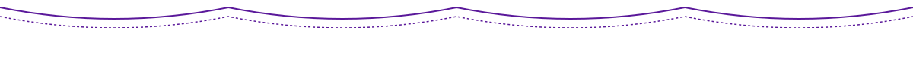

<!-- Story Section 1: The Legend -->

<h2 align="center">📜 THE LEGEND</h2>

<table align="center" border="0" cellpadding="15" cellspacing="0" style="border: 0px; border-collapse: collapse; margin: 0px auto; background-color: #0d1117;">
  <tr style="border: 0px;">
    <!-- Profile Frame with spooky avatar overlay -->
    <td align="center" valign="middle" style="border: 0px; padding: 10px; width: 40%;">
      

        
        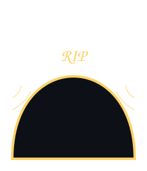
        
      

    </td>
    <!-- Bio Monospace Details -->
    <td valign="top" style="border: 0px; padding: 20px; width: 60%; font-family: monospace; color: #f8f9fa;">
      

        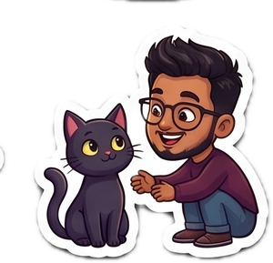
      

      

        
      

      <h3 style="color: #ff7518; margin-top: 0;">&gt; COFFIN_NODE.conf</h3>
      
<b>&gt; IDENTITY:</b> Charan BS / @CharanBS18

      
<b>&gt; ACCESS_PORT:</b> <a href="mailto:charan201204@gmail.com" style="color: #39ff14;">charan201204@gmail.com</a>

      
<b>&gt; ALIGNMENT:</b> <code style="color: #ffd166;">Frontend Wizard [Level 99]</code>

      

      

        Welcome, mortal visitor, to the spectral repository node. I craft responsive, high-performance web structures using midnight potions, green slime, and dark-mode coding rituals. I believe in clean code, robust architectures, and pixel-perfect design craftsmanship.
      

    </td>
  </tr>
</table>

  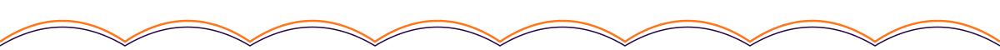

<!-- Story Section 2: Potion Ingredients (Skills) -->

<h2 align="center">🧪 POTION INGREDIENTS</h2>

<!-- Potion bottle skills grids -->

  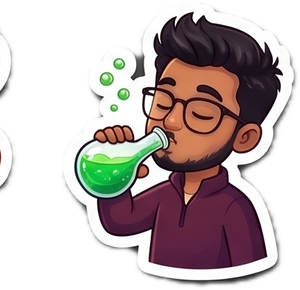
  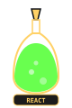
  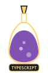
  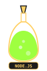
  
  
  
  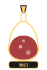
  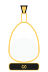
  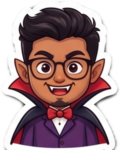

<!-- Spell cards details -->
<table align="center" border="0" cellpadding="10" cellspacing="0" style="border: 0px; border-collapse: collapse; margin: 0px auto;">
  <tr style="border: 0px;">
    <td style="border: 0px;">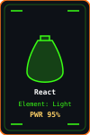</td>
    <td style="border: 0px;">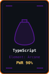</td>
    <td style="border: 0px;">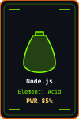</td>
    <td style="border: 0px;">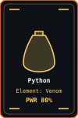</td>
  </tr>
</table>

  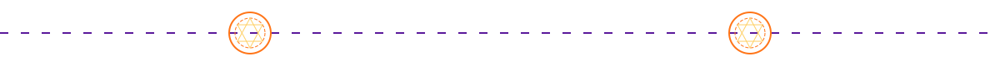

<!-- Story Section 3: Haunted Laboratory (Current Work) -->

<h2 align="center">🕯 HAUNTED LABORATORY</h2>

<table align="center" border="0" cellpadding="15" cellspacing="0" style="border: 0px; border-collapse: collapse; margin: 0px auto; background-color: #0d1117;">
  <tr style="border: 0px;">
    <!-- Terminal GIF -->
    <td align="center" valign="middle" style="border: 0px; padding: 10px; width: 45%;">
      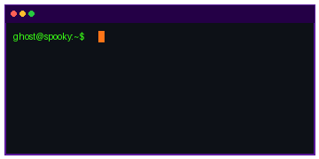
    </td>
    <!-- Status Text -->
    <td valign="top" style="border: 0px; padding: 20px; width: 55%; font-family: monospace; color: #f8f9fa; line-height: 1.6;">
      

        
      

      

        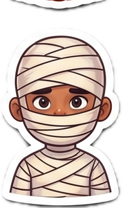
      

      <h3 style="color: #ff7518; margin-top: 0; clear: both;">&gt; ACTIVE_EXPERIMENT.bin</h3>
      
<b>&gt; STATUS:</b> Brewing spell-check algorithms

      
<b>&gt; OBJECTIVE:</b> Building lightweight, pixel-perfect layout nodes

      
<b>&gt; INGREDIENTS:</b> <code>TailwindCSS</code> <code>Next.js</code> <code>Pillow</code>

    </td>
  </tr>
</table>

  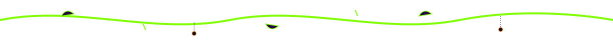

<!-- Story Section 4: Spellbook (Projects) -->

<h2 align="center">📖 SPELLBOOK</h2>

<table align="center" border="0" cellpadding="15" cellspacing="0" style="border: 0px; border-collapse: collapse; margin: 0px auto; width: 100%; max-width: 900px;">
  <tr style="border: 0px;">
    <!-- Project 1 Spellbook Card -->
    <td valign="top" style="border: 0px; width: 50%; padding: 15px; text-align: center;">
      
       
      
    </td>
    <!-- Project 2 Spellbook Card -->
    <td valign="top" style="border: 0px; width: 50%; padding: 15px; text-align: center;">
      
       
      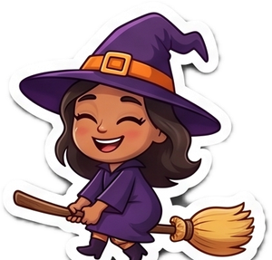
    </td>
  </tr>
</table>

  

<!-- Story Section 5: Ancient Relics (Achievements) -->

<h2 align="center">🏆 ANCIENT RELICS</h2>

  
  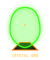
  
  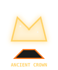
  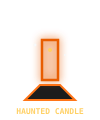
  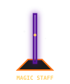
  
  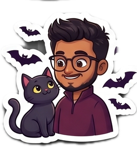

  

<!-- Story Section 6: Moonlit Activity (Stats & Contributions) -->

<h2 align="center">🌙 MOONLIT ACTIVITY</h2>

<table align="center" border="0" cellpadding="10" cellspacing="0" style="border: 0px; border-collapse: collapse; margin: 0px auto;">
  <tr style="border: 0px;">
    <!-- Character RPG Status Card -->
    <td align="center" valign="middle" style="border: 0px; padding: 10px;">
      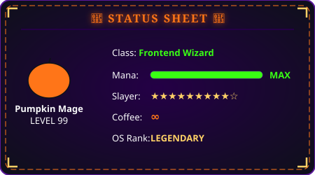
       
      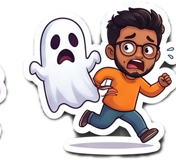
    </td>
    <!-- Commits and languages grids -->
    <td align="center" valign="middle" style="border: 0px; padding: 10px;">
      

        
        
      

       
      
    </td>
  </tr>
</table>

<!-- Graveyard Wrapped Contribution Graph -->

  <!-- Contribution Graveyard Arch frame -->
  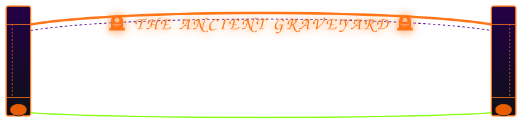

  <!-- Contribution grid snake game (offset behind columns) -->
  <picture>
    <source media="(prefers-color-scheme: dark)" srcset="https://raw.githubusercontent.com/CharanBS18/CharanBS18/output/github-contribution-grid-snake.svg?v=2">
    <source media="(prefers-color-scheme: light)" srcset="https://raw.githubusercontent.com/CharanBS18/CharanBS18/output/github-contribution-grid-snake-light.svg?v=2">
    
  </picture>

<!-- Trophies Display -->

  

  

<!-- Story Section 6.5: Familiar Spirits (Collage of all remaining stickers) -->

<h2 align="center">🦇 FAMILIAR SPIRITS</h2>

  The many spectral forms and familiars conjured inside this Halloween code capsule:

  
  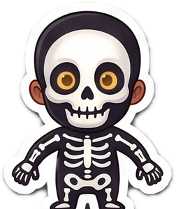
  
  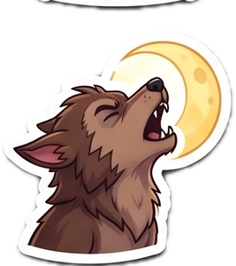
  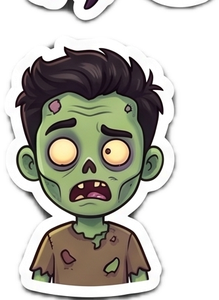
  
  

  

<!-- Story Section 7: Raven Mail (Contact) -->

<h2 align="center">📮 RAVEN MAIL</h2>

  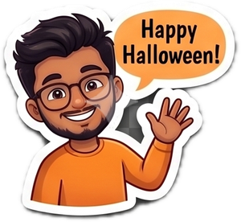
  <a href="mailto:charan201204@gmail.com" style="display: inline-block; background-color: #240046; color: #ff7518; border: 2px solid #ff7518; padding: 12px 24px; border-radius: 6px; text-decoration: none; font-weight: bold; font-family: monospace; height: fit-content; align-self: center;">
    📧 SEND RAVEN SUMMONS
  </a>

<!-- Spooky Forest Footer -->

  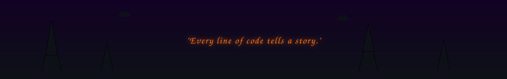

  PORTAL SECURED VISITORS:  // SECURE CONNECTIONS COMPLETED // STAY SPOOKY 🎃

